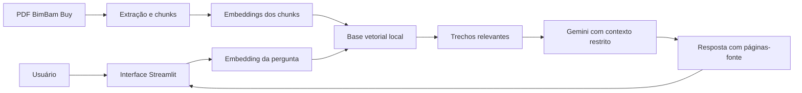

# Agente BimBam Buy

Agente corporativo com RAG (Retrieval-Augmented Generation) desenvolvido para o **Challenge Alura Agente**, da formação **ONE AI For Tech - Oracle Next Education**.

O sistema responde perguntas sobre reembolsos e devoluções usando exclusivamente a **Política de Reembolsos e Devoluções da BimBam Buy**, uma empresa fictícia de e-commerce. Quando o PDF não contém a informação solicitada, o agente informa que não encontrou a resposta, em vez de inventá-la.

## Aplicação publicada

**Acesse:** [https://alura.147-15-123-74.sslip.io](https://alura.147-15-123-74.sslip.io)

A aplicação está implantada em uma instância **OCI Compute**, executada em contêiner Docker e publicada com Nginx e HTTPS.


## Problema e solução

Colaboradores normalmente precisam procurar respostas manualmente em documentos internos. Este projeto transforma um PDF corporativo em uma base pesquisável:

1. extrai o texto das 14 páginas do PDF;
2. limpa e divide o conteúdo em chunks com indicação de página;
3. transforma os chunks em embeddings com o Gemini;
4. salva os vetores em uma base vetorial local;
5. transforma a pergunta do usuário em embedding;
6. encontra os trechos semanticamente mais próximos;
7. envia somente esses trechos ao modelo de linguagem;
8. mostra a resposta e as páginas consultadas.

## Arquitetura



O índice atual contém **24 chunks** e embeddings normalizados de **768 dimensões**. A similaridade é calculada por produto escalar entre vetores normalizados, equivalente à similaridade de cosseno.

## Tecnologias

- Python 3.12
- Streamlit
- Google Gemini (`gemini-3.5-flash-lite`)
- Gemini Embeddings (`gemini-embedding-001`)
- pypdf
- NumPy
- Docker e Docker Compose
- Nginx e Let's Encrypt
- Oracle Cloud Infrastructure - OCI Compute
- Telegram Bot API para homologação visual opcional
- Pytest

O projeto não usa LangChain. A implementação direta mantém o código pequeno e deixa visíveis as etapas essenciais do RAG.

## Estrutura do projeto

```text
.
├── app.py                         # interface web
├── telegram_bots.py               # inicia os dois bots de homologação
├── data/
│   ├── politica_...pdf            # documento-fonte
│   └── perguntas_teste.json       # matriz de avaliação
├── src/bimbam_rag/
│   ├── document.py                # leitura, limpeza e chunks
│   ├── vector_store.py            # armazenamento e busca vetorial
│   ├── service.py                 # fluxo RAG completo
│   └── telegram_demo.py           # coordenação dos dois bots
├── scripts/
│   ├── build_index.py             # cria a base vetorial
│   ├── evaluate_rag.py            # executa avaliação real
│   ├── deploy_oci.sh              # deploy reproduzível
│   └── verify_deploy.py           # healthcheck do deploy
├── tests/                          # testes automatizados
├── Dockerfile
└── docker-compose.yml
```

## Executar localmente

### Pré-requisitos

- Python 3.12 ou mais recente;
- uma chave da API Gemini.

### Instalação

```bash
git clone https://github.com/go3aline-ui/alura.git
cd alura
python -m venv .venv
```

Ative o ambiente virtual:

```bash
# Windows
.venv\Scripts\activate

# Linux ou macOS
source .venv/bin/activate
```

Instale as dependências e configure o ambiente:

```bash
pip install -r requirements.txt
cp .env.example .env
```

Preencha somente `GEMINI_API_KEY` no arquivo `.env`. Nunca publique esse arquivo.

Crie o índice vetorial e inicie a interface:

```bash
python scripts/build_index.py
streamlit run app.py
```

A aplicação estará disponível em `http://localhost:8501`.

## Executar os testes

Os testes unitários não consomem a API:

```bash
pip install -r requirements-dev.txt
pytest -q
```

Para executar a matriz com embeddings e respostas reais:

```bash
python scripts/evaluate_rag.py
```

O relatório é salvo em `reports/avaliacao_rag.json` e não contém credenciais.

## Exemplos reais

### Pergunta coberta pelo documento

**Pergunta:** Qual é o prazo para devolver um produto por arrependimento?

**Resposta:** O prazo para solicitar a devolução por arrependimento é de até 10 dias corridos subsequentes ao recebimento do pedido, desde que o produto cumpra os requisitos de elegibilidade. Fonte: página 4.

### Outra pergunta coberta

**Pergunta:** Quem paga a devolução quando a BimBam Buy enviou o produto errado?

**Resposta:** Se a devolução ocorrer por erro atribuível à BimBam Buy, a coleta ou devolução não terá custo para o cliente. Fonte: página 7.

### Pergunta fora do documento

**Pergunta:** A BimBam Buy oferece cartão de crédito próprio?

**Resposta:** Não encontrei essa informação na Política de Reembolsos e Devoluções da BimBam Buy. Tente reformular a pergunta usando detalhes do pedido, da devolução ou do reembolso.

## Homologação com dois bots do Telegram

O projeto oferece uma demonstração opcional em um grupo privado:

- **Bot Cliente/Auditor:** publica perguntas e avalia conteúdo, fontes e recusa segura;
- **Bot Atendente RAG:** publica a resposta produzida pelo mesmo serviço usado na interface.

O servidor coordena os turnos para impedir loops entre bots. Comandos disponíveis no grupo:

```text
/demo
/pergunta Qual é o prazo para devolver um produto?
/status
```

As credenciais do Telegram ficam somente no `.env`. A funcionalidade não é necessária para usar a interface web nem para compreender o RAG.

A homologação executada na OCI concluiu os seis casos da matriz com aprovação integral:


## Deploy na OCI

O deploy atual usa uma instância ARM da Oracle Cloud Infrastructure. A aplicação fica isolada dos outros serviços da instância e escuta apenas em `127.0.0.1:8502`; o Nginx publica o domínio com HTTPS.

No servidor:

```bash
git clone https://github.com/go3aline-ui/alura.git /home/ubuntu/alura-rag
cd /home/ubuntu/alura-rag
cp .env.example .env
# preencher GEMINI_API_KEY
chmod +x scripts/deploy_oci.sh
./scripts/deploy_oci.sh
```

Validação após o deploy:

```bash
python scripts/verify_deploy.py https://alura.147-15-123-74.sslip.io
```

## Proteções contra respostas inventadas

- prompt obriga o modelo a usar somente os chunks recuperados;
- temperatura criativa não é utilizada;
- a resposta informa as páginas consultadas;
- perguntas sem suporte recebem uma resposta de ausência padronizada;
- chunks vizinhos são incluídos quando uma seção atravessa a quebra de página;
- a matriz de avaliação inclui deliberadamente uma pergunta fora do documento;
- erros internos são apresentados ao usuário sem expor chave, stack trace ou dados sensíveis.

## Escopo

O projeto suporta intencionalmente um único PDF. Essa decisão mantém a solução objetiva e atende ao escopo mínimo do Challenge. Upload de documentos, autenticação de usuários, banco vetorial externo e painel administrativo ficaram fora do projeto por não serem necessários para a entrega.

## Autoria

Desenvolvido por [go3aline-ui](https://github.com/go3aline-ui) para o programa Oracle Next Education.
