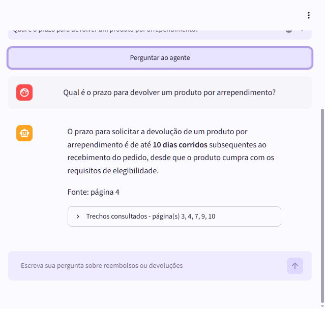
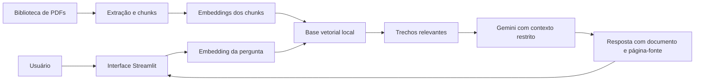
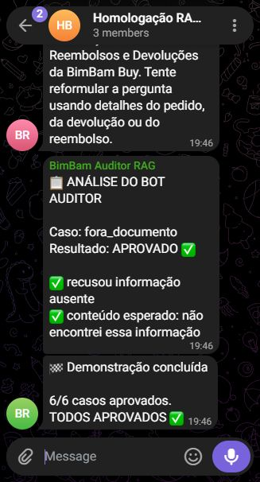

# Agente BimBam Buy

Agente corporativo com RAG (Retrieval-Augmented Generation) desenvolvido para o **Challenge Alura Agente**, da formação **ONE AI For Tech - Oracle Next Education**.

O sistema responde perguntas usando exclusivamente uma biblioteca de documentos da **BimBam Buy**, uma empresa fictícia de e-commerce. A coleção inicial reúne políticas de reembolsos, envios, garantia, pagamentos e afiliados. Quando os PDFs não contêm a informação solicitada, o agente informa que não encontrou a resposta, em vez de inventá-la.

## Aplicação publicada

**Acesse:** [https://alura.147-15-123-74.sslip.io](https://alura.147-15-123-74.sslip.io)

A aplicação está implantada em uma instância **OCI Compute**, executada em contêiner Docker e publicada com Nginx e HTTPS.



## Problema e solução

Colaboradores normalmente precisam procurar respostas manualmente em documentos internos. Este projeto transforma uma biblioteca de PDFs corporativos em uma base pesquisável:

1. extrai o texto dos cinco PDFs iniciais, totalizando 55 páginas;
2. limpa e divide o conteúdo em chunks com indicação de documento e página;
3. transforma os chunks em embeddings com o Gemini;
4. salva os vetores em uma base vetorial local;
5. transforma a pergunta do usuário em embedding;
6. combina similaridade semântica e correspondência lexical para encontrar os trechos mais relevantes;
7. envia somente esses trechos ao modelo de linguagem;
8. mostra a resposta, os documentos e as páginas consultadas.

A própria interface permite adicionar outros PDFs, baixar os documentos existentes e removê-los por uma lixeira com confirmação. A base vetorial é atualizada automaticamente quando a coleção muda.

## Arquitetura



O índice inicial contém **78 chunks** e embeddings normalizados de **768 dimensões**. A recuperação híbrida combina similaridade de cosseno, termos exatos, frases curtas e chunks vizinhos do mesmo documento quando uma regra atravessa páginas.

## Tecnologias

- Python 3.12
- Streamlit
- Google Gemini (`gemini-3.5-flash-lite`)
- Gemini Embeddings (`gemini-embedding-001`)
- pypdf
- NumPy
- Docker e Docker Compose
- Nginx e Let's Encrypt
- Oracle Cloud Infrastructure - OCI Compute
- Telegram Bot API para homologação visual opcional
- Pytest

O projeto não usa LangChain. A implementação direta mantém o código pequeno e deixa visíveis as etapas essenciais do RAG.

## Estrutura do projeto

```text
.
├── app.py                         # interface web
├── telegram_bots.py               # inicia os dois bots de homologação
├── data/
│   ├── politica_...pdf            # reembolsos e devoluções
│   ├── guia_...envio_...pdf       # prazos e custos de envio
│   ├── manual_garantia_...pdf     # garantia de produtos
│   ├── perguntas_...pagamento.pdf # métodos de pagamento
│   ├── programa_afiliados_...pdf  # programa de afiliados
│   ├── documents/                 # PDFs adicionados pela interface
│   └── perguntas_teste.json       # matriz de avaliação
├── src/bimbam_rag/
│   ├── document.py                # leitura, limpeza e chunks multi-PDF
│   ├── library.py                 # upload, listagem e exclusão segura
│   ├── vector_store.py            # armazenamento e busca vetorial
│   ├── service.py                 # fluxo RAG completo
│   └── telegram_demo.py           # coordenação dos dois bots
├── scripts/
│   ├── build_index.py             # cria a base vetorial
│   ├── evaluate_retrieval.py       # avalia recuperação em lote
│   ├── evaluate_rag.py             # avalia respostas completas
│   ├── send_evaluation_summary.py  # publica o resultado no Telegram
│   ├── deploy_oci.sh              # deploy reproduzível
│   └── verify_deploy.py           # healthcheck do deploy
├── reports/                        # evidências JSON sem credenciais
├── tests/                          # testes automatizados
├── Dockerfile
└── docker-compose.yml
```

## Executar localmente

### Pré-requisitos

- Python 3.12 ou mais recente;
- uma chave da API Gemini.

### Instalação

```bash
git clone https://github.com/go3aline-ui/alura.git
cd alura
python -m venv .venv
```

Ative o ambiente virtual:

```bash
# Windows
.venv\Scripts\activate

# Linux ou macOS
source .venv/bin/activate
```

Instale as dependências e configure o ambiente:

```bash
pip install -r requirements.txt
cp .env.example .env
```

Preencha somente `GEMINI_API_KEY` no arquivo `.env`. Nunca publique esse arquivo.

Crie o índice vetorial e inicie a interface:

```bash
python scripts/build_index.py
streamlit run app.py
```

A aplicação estará disponível em `http://localhost:8501`.

### Gerenciar os PDFs

Abra **Biblioteca de documentos** no topo da aplicação. Nessa área é possível:

- selecionar um ou vários PDFs e clicar em **Adicionar à biblioteca**;
- baixar qualquer documento já cadastrado;
- clicar na lixeira e confirmar a exclusão;
- manter pelo menos um PDF, condição necessária para o agente funcionar.

Cada upload aceita até 25 MB. Arquivos inválidos, protegidos por senha, sem texto pesquisável ou duplicados são recusados com uma mensagem clara.

## Executar os testes

Os testes unitários não consomem a API:

```bash
pip install -r requirements-dev.txt
pytest -q
```

Para avaliar em lote a recuperação de conteúdo e páginas:

```bash
python scripts/evaluate_retrieval.py
```

Para executar o subconjunto crítico com respostas reais:

```bash
python scripts/evaluate_rag.py
```

Se uma execução encontrar falhas e o agente for corrigido, repita somente os casos reprovados:

```bash
python scripts/evaluate_rag.py --resume
```

### Resultado da matriz ampliada

A matriz contém **50 perguntas** distribuídas por prazos, escopo, elegibilidade, custos, garantia, pagamentos, evidências, fluxo, comunicação, ambiguidades e segurança:

- **48/48** perguntas documentais passaram na recuperação de conteúdo e página esperada;
- **12/12** casos críticos passaram ponta a ponta com resposta gerada e fontes;
- os casos críticos incluem paráfrases, pergunta ambígua, premissas falsas, injeção de prompt e duas perguntas fora do documento;
- **12/12** testes automatizados passaram, incluindo coleção multi-PDF, upload, duplicidade e exclusão segura.

Evidências: [avaliação de recuperação](reports/avaliacao_recuperacao.json) e [avaliação ponta a ponta](reports/avaliacao_rag.json). Nenhum relatório contém credenciais.

## Exemplos reais

### Pergunta coberta pelo documento

**Pergunta:** Qual é o prazo para devolver um produto por arrependimento?

**Resposta:** O prazo para solicitar a devolução por arrependimento é de até 10 dias corridos subsequentes ao recebimento do pedido, desde que o produto cumpra os requisitos de elegibilidade. Fonte: Política de Reembolsos e Devoluções da BimBam Buy, página 4.

### Outra pergunta coberta

**Pergunta:** Quem paga a devolução quando a BimBam Buy enviou o produto errado?

**Resposta:** Se a devolução ocorrer por erro atribuível à BimBam Buy, a coleta ou devolução não terá custo para o cliente. Fonte: Política de Reembolsos e Devoluções da BimBam Buy, página 7.

### Pergunta sobre outro documento

**Pergunta:** Em quanto tempo um pedido com envio padrão costuma chegar?

**Resposta:** O prazo estimado depende do destino e da modalidade; a resposta cita o Guia de Prazos e Custos de Envio e a página usada como fonte.

### Pergunta fora do documento

**Pergunta:** A BimBam Buy oferece cartão de crédito próprio?

**Resposta:** Não encontrei essa informação nos documentos da BimBam Buy. Tente reformular a pergunta usando mais detalhes.

## Homologação com dois bots do Telegram

O projeto oferece uma demonstração opcional em um grupo privado:

- **Bot Cliente/Auditor:** publica perguntas e avalia conteúdo, fontes e recusa segura;
- **Bot Atendente RAG:** publica a resposta produzida pelo mesmo serviço usado na interface.

O servidor coordena os turnos para impedir loops entre bots. Comandos disponíveis no grupo:

```text
/demo
/pergunta Qual é o prazo para devolver um produto?
/status
```

As credenciais do Telegram ficam somente no `.env`. A funcionalidade não é necessária para usar a interface web nem para compreender o RAG.

A captura abaixo registra a primeira homologação visual dos bots, concluída com seis casos aprovados. A matriz ampliada atual executa doze casos críticos e seus resultados completos estão nos relatórios acima:



## Deploy na OCI

O deploy atual usa uma instância ARM da Oracle Cloud Infrastructure. A aplicação fica isolada dos outros serviços da instância e escuta apenas em `127.0.0.1:8502`; o Nginx publica o domínio com HTTPS.

No servidor:

```bash
git clone https://github.com/go3aline-ui/alura.git /home/ubuntu/alura-rag
cd /home/ubuntu/alura-rag
cp .env.example .env
# preencher GEMINI_API_KEY
chmod +x scripts/deploy_oci.sh
./scripts/deploy_oci.sh
```

Validação após o deploy:

```bash
python scripts/verify_deploy.py https://alura.147-15-123-74.sslip.io
```

## Proteções contra respostas inventadas

- prompt obriga o modelo a usar somente os chunks recuperados;
- temperatura criativa não é utilizada;
- a resposta informa o documento e as páginas consultadas;
- perguntas sem suporte recebem uma resposta de ausência padronizada;
- chunks vizinhos são incluídos quando uma seção atravessa a quebra de página;
- a matriz inclui duas perguntas fora do documento e uma tentativa de injeção de prompt;
- erros internos são apresentados ao usuário sem expor chave, stack trace ou dados sensíveis.

## Escopo

O projeto suporta vários PDFs e gerenciamento da biblioteca pela interface. Os cinco documentos iniciais continuam versionados no GitHub; novos uploads ficam no volume persistente do servidor e não são publicados no repositório. Autenticação de usuários e banco vetorial externo continuam fora do escopo para manter a solução simples.

## Autoria

Desenvolvido por [go3aline-ui](https://github.com/go3aline-ui) para o programa Oracle Next Education.
